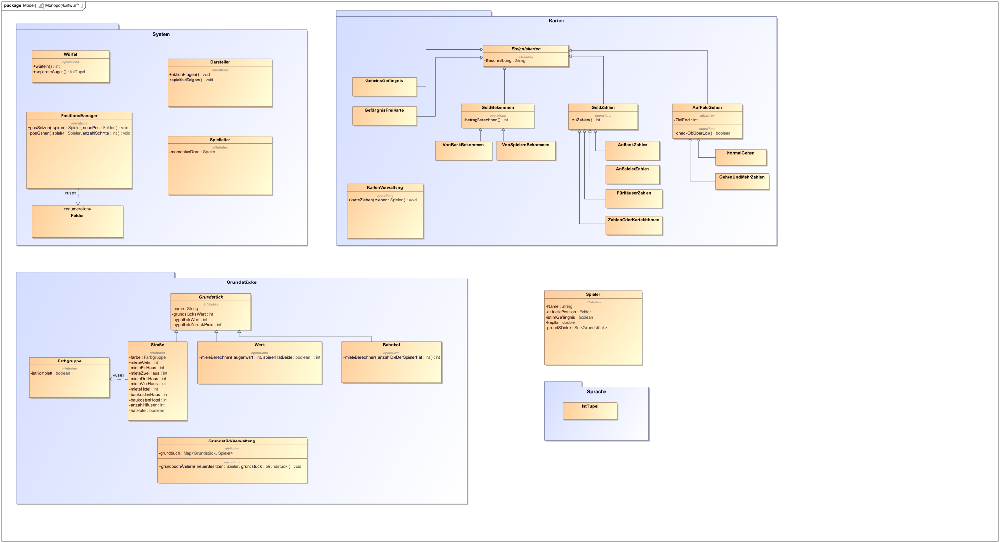

= Projekt Plan 

== Grundidee
Inspiriert von der Monopoly Version für Ninendo Switch wollte ich eine rudimentäre Version selber schreiben.
Weil ich kein Künstler bin, habe ich mich entschieden das ganze Spiel im Terminal darzustellen.
Weil ich schon länger Python lernen wollte, werde ich dieses Projekt damit realisieren.

== Soll
2 bis 4 Spieler sollen auf einem Computer mit dem Terminal Monolopy spielen können.
Eingabe erfolgt ausschließlich über die Tastatur.
Am Anfang sollen die Spieler ihre Namen eingeben und eine Spielfigur auswählen können.

Dann soll das Monopoly nach den Standartregeln gespielt werden können, inklusive:

- Würfeln
- Grundstücke kaufen 
- Häuser und Hotels bauen
- Miete zahlen und bekommen
- Handeln mit anderen Spielern
- Ins Gefängnis gehen und rauskommen

== Erster Entwurf

== Fortschritt
=== 1.1.21
- Ersten Entwurf erstellt
- Mit Python experimentiert

== Nächste Schritte
1. Spieler, Test-Spielfeld und Würfel erstellen um den Spieler auf dem Spielfeld zu bewegen, noch ohne die jeweilige Aktion auszuführen
2. Über Los gehen und Geld bekommen können
3. Grundstücke erstellen und die Fähigkeit diese zu kaufen implementieren
4. Häuser und Hotels bauen
5. Ins Gefängnis gehen (wenn auf das Feld kommen oder drei Pasche hintereinander) und wieder frei kommen können
6. Ereigniskarten ziehen mit den jeweiligen Effekten
7. Handel mit anderen Spielern
